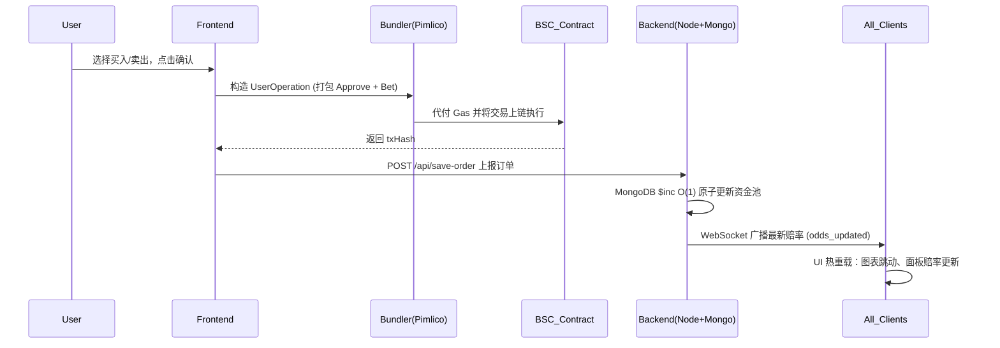
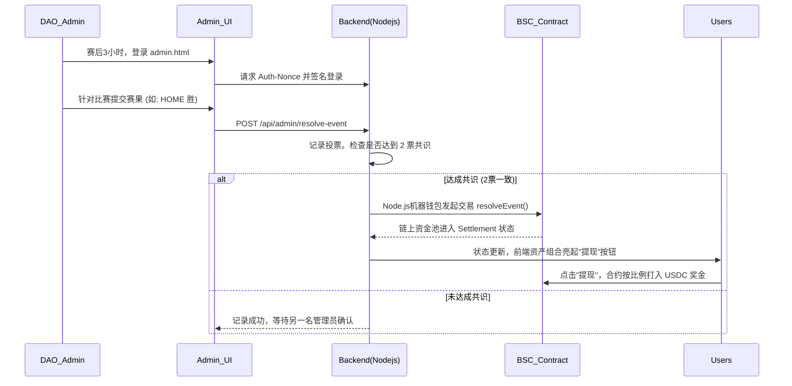

# ⚽ GlobalCup 2026 - Web3 预测市场交易终端

> GlobalCup 2026 是一个基于 **BSC (Binance Smart Chain)** 构建的去中心化预测市场 DApp。项目采用 **账户抽象 (ERC-4337) 免 Gas 技术**，结合 **AMM 份额交易模型 (Shares AMM)** 与 **DAO 多签裁决机制**，为用户提供丝滑、专业的 Web3 体育赛事预测和交易体验。

---

## 🌟 一、 功能说明 (Features)

### 1. ERC-4337 免 Gas 交易 (Gasless Trading)
- 集成 **AppKit**、**Viem** 与 **Permissionless.js**，通过 Pimlico Paymaster 赞助 Gas 费。
- 自动为用户创建 Safe 智能账户，一键完成 `Approve` 和 `Bet` 的批量交易上链，极大降低 Web3 门槛。

### 2. AMM 份额双向交易 (Share-based AMM & Cash Out)
- 摒弃传统固定赔率，采用动态资金池算法。
- 支持 **买入 (Buy)** 和 **卖出 (Sell/Cash out)**。用户可随时根据实时赔率提前平仓，锁定利润或止损。

### 3. 实时行情推送 (Real-time Odds)
- 结合 MongoDB `O(1)` 原子更新与 WebSocket (`Socket.io`) 毫秒级全网广播。
- 任何用户的下注均会瞬间引起全网赔率和图表的动态热刷新。

### 4. 全方位资产组合 (Portfolio & Favorites)
- 提供直观的"资产组合"面板，实时展示持有份额的 **当前市值 (Current Value)** 与 **未实现盈亏 (Unrealized PnL)**。
- 支持赛事一键收藏 (Favorites) 与跨面板状态联动。

### 5. DAO 多签安全裁决 (DAO Multi-sig Resolution)
- 独立的 `admin.html` 裁决控制台。基于 Web3 钱包 Nonce 签名认证。
- 赛事结束后，需两名 DAO 成员投票一致，后端机器人自动将结果上链，触发资金池结算，杜绝单点作恶。

### 6. 智能多语言 (i18n Auto-detection)
- 通过 IP Geolocation 与 Browser Headers 自动识别用户所属地。
- 原生支持 English、中文 (zh)、ລາ​ວ (老挝语 lo)，支持 UI 与底层数据的无缝热切换。

---

## 🔌 二、 技术接口一览 (API Overview)

系统后端基于 **Node.js (Express) + MongoDB** 构建。

### 1. 公共数据接口 (Public API)
| 接口路径 | 方法 | 功能描述 |
| :--- | :--- | :--- |
| `/api/events` | `GET` | 获取所有存储在数据库中的赛事基础信息。 |
| `/api/win-rates` | `GET` | 获取当前所有赛事的实时资金池总额及动态胜率（赔率）。 |
| `/api/trades/:id` | `GET` | 获取指定赛事 (eventId) 的所有历史成交记录。 |
| `/api/locale` | `GET` | 回退语言检测接口，通过解析请求头 `Accept-Language` 返回推荐语言。 |

### 2. 交易与用户接口 (Trading & User API)
| 接口路径 | 方法 | 功能描述 |
| :--- | :--- | :--- |
| `/api/save-order` | `POST` | 接收前端下注/平仓数据，原子化更新 (`$inc`) 资金池，并触发 WS 广播。 |
| `/api/user-portfolio` | `GET` | 传入 `address`，返回该智能账户的完整下注历史、持仓市值及总盈亏。 |
| `/api/user-payouts` | `GET` | 传入 `address`，返回该账户已中奖且可提取收益的订单列表。 |
| `/api/pimlico/56` | `POST` | 代理转发 Bundler/Paymaster 请求，隐藏 API Key。 |

### 3. DAO 管理员接口 (Admin API)
> **注意：** 以下接口均需通过 `verifyDaoAuth` 中间件，校验 Header 中的 `x-wallet-address`, `x-signature`, `x-nonce`, `x-timestamp`。

| 接口路径 | 方法 | 功能描述 |
| :--- | :--- | :--- |
| `/api/admin/auth-nonce` | `GET` | 登录前置接口，生成防重放的一次性签名消息 (Nonce)。 |
| `/api/admin/resolve-event`| `POST` | 提交裁决投票。当两票一致时，后端自动调用智能合约 `resolveEvent` 结算上链。 |
| `/api/admin/dao-members` | `GET` | 获取当前白名单中的所有 DAO 成员列表。 |
| `/api/admin/dao-members` | `POST` | 添加新的 DAO 成员 BSC 钱包地址。 |
| `/api/admin/dao-members/:address`| `DELETE`| 移除指定的 DAO 成员权限（禁止移除超级管理员和自身）。 |

---

## 🔄 三、 工作流流程图 (Workflow)

### 1. 核心交易与实时盘口更新流 (User Trading Flow)

### 2. DAO 多签裁决与自动清算流 (DAO Resolution Flow)

---

## 📖 四、 用户操作指南 (Operation Guide)

### 👤 普通玩家指南
1. **连接钱包与激活**：打开平台主页，点击右上角**【连接 Web3Wallet】**。授权后，系统会自动为您在 BSC 链上创建一个专属的免 Gas 交易智能账户。
2. **划转资金 (充值)**：首次下注前，点击右上角钱包面板的**【充值】**。输入金额，确认后资金将从您的个人 EOA 钱包转移到平台智能账户。
3. **双向交易体验**：
   - **买入 (Buy)**：在右侧面板选择看好的队伍，输入 USDC 金额，点击买入，获得对应数量的"份额 (Shares)"。
   - **提前平仓 (Cash Out)**：若比赛期间赔率对您有利，可打开右上角**【资产组合】**，在"投注记录"中点击 `[Cash Out]`。系统将按当前的实时市价回收您的份额，并立即退还 USDC。
4. **赛后提现**：比赛结束并经 DAO 裁决后，若您持有获胜方的份额，请进入【资产组合】点击**【提现】**。赢取的本金与利润将自动转入您的智能账户，并伴有撒花庆祝特效。

### 🛡️ DAO 管理员指南
1. **后台登录**：
   - 访问 `http://[你的域名或IP]:3010/admin.html`。
   - 点击【连接钱包并验证身份】，并在 MetaMask 中对系统发放的一次性消息 (Nonce) 进行免费的密码学签名。
2. **多签裁决**：
   - 登录后，在【待裁决赛事】面板中，您会看到所有 **开赛时间已超过 3 小时** 且尚未结算的比赛。
   - 根据真实赛果，点击"主队胜"、"客队胜"或"平局"。
   - 当有两位 DAO 成员对同一比赛投出相同结果时，系统将自动触发智能合约，将该比赛的资金池结算上链。
3. **DAO 成员管理**：
   - 切换到【DAO 成员管理】标签页。
   - 您可以输入其他信任合伙人的 BSC 钱包地址，将其添加为拥有投票权的 DAO 管理员，也可随时移除（超级管理员不可被移除）。
