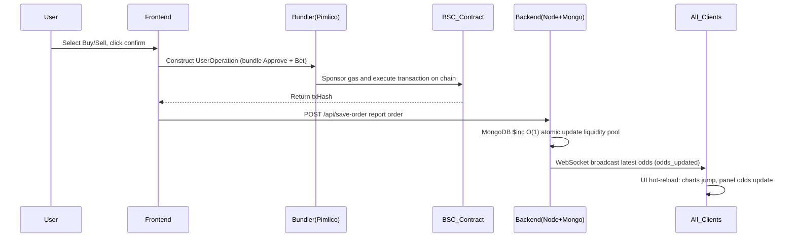
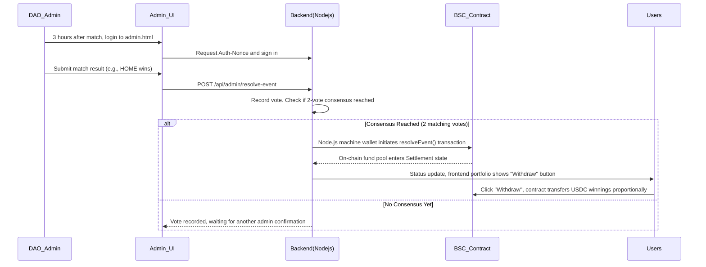

# ⚽ GlobalCup 2026 - Web3 Prediction Market Trading Terminal

> GlobalCup 2026 is a decentralized prediction market DApp built on **BSC (Binance Smart Chain)**. The project leverages **Account Abstraction (ERC-4337) gasless technology**, combining **AMM share trading (Shares AMM)** with **DAO multi-signature resolution**, providing users with a seamless and professional Web3 sports prediction and trading experience.

---

## 🌟 Features

### 1. ERC-4337 Gasless Trading
- Integrated **AppKit**, **Viem**, and **Permissionless.js**, with Pimlico Paymaster sponsoring gas fees.
- Automatically creates Safe smart accounts for users, executing batch transactions like `Approve` + `Bet` in one click, greatly lowering the Web3 barrier.

### 2. AMM Share-based Bidirectional Trading (Share-based AMM & Cash Out)
- Abandoning traditional fixed odds, adopting dynamic liquidity pool algorithms.
- Supports **Buy** and **Sell/Cash Out**. Users can close positions early at any time based on real-time odds to lock in profits or cut losses.

### 3. Real-time Odds Push
- Combining MongoDB `O(1)` atomic updates with WebSocket (`Socket.io`) millisecond-level broadcast.
- Any user's bet will instantly trigger dynamic hot-refresh of odds and charts across the entire network.

### 4. Comprehensive Portfolio & Favorites
- Intuitive "Portfolio" panel showing real-time **Current Value** and **Unrealized PnL** of held shares.
- Supports one-click event favorites and cross-panel state linkage.

### 5. DAO Multi-signature Secure Resolution
- Independent `admin.html` resolution console. Based on Web3 wallet Nonce signature authentication.
- After an event ends, two DAO members must vote consistently, and the backend bot automatically onboards the result to the chain, triggering fund pool settlement, preventing single-point malicious behavior.

### 6. Smart Multi-language (i18n Auto-detection)
- Automatically identifies user location via IP Geolocation and Browser Headers.
- Native support for **English**, 中文 (zh), ไทย (th) with seamless hot-switching for both UI and underlying data.

---

## 🎮 Community Demo: 5-Step Guide

> Welcome to GlobalCup 2026 — the world's first zero-gas, fully on-chain, fiat-OTC-supported decentralized World Cup prediction market! Here's how you start earning in **5 simple steps**:

### 🌟 Step 1: 1-Second Seamless Login (Zero Barrier)
- **Traditional pain point:** Playing Web3 requires buying BNB for gas fees — newcomers are discouraged.
- **Our solution:** Click **[Connect Web3Wallet]**, and the system automatically assigns you a **Smart Account**. No BNB needed — every bet and withdrawal you make on the platform is gas-sponsored by the platform treasury! Truly: click and play.

### 💳 Step 2: One-Click Deposit (Fiat OTC Supported)
Three lightning-fast deposit channels:
- **Chain veteran:** Click **[Deposit]** → select BSC → transfer USDC from your MetaMask wallet.
- **TRON user:** Select TRON network → trigger TronLink to pay USDT → system auto cross-chains to USDC.
- **Fiat newbie (Exclusive OTC):** Click **[💱 OTC Fiat Exchange]** top-left → select platform-certified merchant → pay via Alipay/WeChat. Upload screenshot, merchant releases funds instantly — USDC lands directly in your Smart Account!

### 🛒 Step 3: Shop for "Win Rates" Like Taobao (Cart Batch Packing)
**Core mechanic:** Matches are no longer dull gambling — they become stock trading. Example: Argentina's current win rate is 60%, meaning 1 share of "Argentina wins" costs 0.6 USDC. If Argentina wins, each share redeems for 1 USDC — **net profit 0.4 U per share!**

**Exclusive money-saving tech:** Got 5 different matches in your eyes? Don't buy them one by one! Click **[🛒 Add to Cart]**, fill your cart with all 5 matches, then hit **[Batch Send All at Once]**. Powered by the latest ERC-4337 Account Abstraction aggregation — multiple transactions bundled into one, blazing fast!

### 📈 Step 4: "Early Cash Out" Mid-Match (No Lock-in, Anytime Profit-Taking)
- **Our solution:** Buyer's remorse? Or Argentina scored 2 goals in the first half and the win rate surged to 90%? No need to wait until the match ends!
- In the right-side **[Pro Trading Panel]** or **[My Assets]**, click **[Cash Out]**. Sell your shares back to the liquidity pool at the real-time AMM market price, any time, lock in profits instantly.

### 🏆 Step 5: Multi-sig Resolution, Full-Chain Settlement (Absolutely Fair)
- After a match ends, the GlobalCup community's decentralized committee **(DAO)** enters the result via multi-signature.
- Once consensus is reached, the smart contract auto-settles across the entire network. Winners click **[Withdraw]** — USDC returns to wallet instantly, no platform holds or risks.

---

## 🔌 API Overview

Backend built on **Node.js (Express) + MongoDB**.

### 1. Public API
| Endpoint | Method | Description |
| :--- | :--- | :--- |
| `/api/events` | `GET` | Get all event basic info stored in the database. |
| `/api/win-rates` | `GET` | Get current total liquidity pool and dynamic win rates (odds) for all events. |
| `/api/trades/:id` | `GET` | Get all historical trade records for a specified event (eventId). |
| `/api/locale` | `GET` | Fallback language detection — returns recommended language by parsing `Accept-Language` header. |

### 2. Trading & User API
| Endpoint | Method | Description |
| :--- | :--- | :--- |
| `/api/save-order` | `POST` | Receive bet/close data from frontend, atomically update (`$inc`) liquidity pool, trigger WS broadcast. |
| `/api/user-portfolio` | `GET` | Pass `address` to return complete bet history, position market value, and total PnL for that smart account. |
| `/api/user-payouts` | `GET` | Pass `address` to return list of winning orders that can be withdrawn. |
| `/api/pimlico/56` | `POST` | Proxy forwarding Bundler/Paymaster requests, hiding API Key. |

### 3. DAO Admin API
> **Note:** All endpoints below require `verifyDaoAuth` middleware, verifying `x-wallet-address`, `x-signature`, `x-nonce`, `x-timestamp` in headers.

| Endpoint | Method | Description |
| :--- | :--- | :--- |
| `/api/admin/auth-nonce` | `GET` | Pre-login endpoint generating replay-protected one-time signature message (Nonce). |
| `/api/admin/resolve-event`| `POST` | Submit resolution vote. When two votes match, backend automatically calls smart contract `resolveEvent` for on-chain settlement. |
| `/api/admin/dao-members` | `GET` | Get all DAO members in current whitelist. |
| `/api/admin/dao-members` | `POST` | Add new DAO member BSC wallet address. |
| `/api/admin/dao-members/:address`| `DELETE`| Remove specified DAO member permission (super admin and self cannot be removed). |

---

## 🔄 Workflow Diagrams

### 1. Core Trading & Real-time Odds Update Flow

### 2. DAO Multi-signature Resolution & Auto Settlement Flow

---

## 📖 User Operation Guide

### 👤 Regular User Guide
1. **Connect Wallet & Activate**: Open the main page, click **[Connect Web3Wallet]** in the top right. After authorization, the system will automatically create a dedicated gasless trading smart account for you on BSC.
2. **Transfer Funds (Deposit)**: Before your first bet, click **[Deposit]** in the top right wallet panel. Enter the amount and confirm to transfer funds from your personal EOA wallet to the platform smart account.
3. **Bidirectional Trading**:
   - **Buy**: Select the team you favor in the right panel, enter USDC amount, click buy to get corresponding number of "Shares".
   - **Early Cash Out**: If odds are favorable during the match, open **[Portfolio]** in the top right, click `[Cash Out]` in "Bet History". System will repurchase your shares at current real-time market price and immediately return USDC.
4. **Post-match Withdrawal**: After the match ends and DAO resolves, if you hold shares of the winning side, go to **[Portfolio]** and click **[Withdraw]**. Your principal and profits will be automatically transferred to your smart account with a celebratory confetti effect.

### 🛡️ DAO Admin Guide
1. **Admin Login**:
   - Visit `http://[your-domain-or-IP]:3010/admin.html`.
   - Click **[Connect Wallet & Verify Identity]**, and sign the one-time message (Nonce) from the system in MetaMask (gas-free).
2. **Multi-signature Resolution**:
   - After login, in the **[Pending Resolution Events]** panel, you will see all matches where **match time has exceeded 3 hours** and have not yet been settled.
   - Based on actual match results, click "Home Wins", "Away Wins", or "Draw".
   - When two DAO members vote the same result for the same match, the system will automatically trigger the smart contract to settle that match's fund pool on chain.
3. **DAO Member Management**:
   - Switch to the **[DAO Member Management]** tab.
   - You can enter other trusted partner's BSC wallet address to add them as a DAO admin with voting rights, or remove them at any time (super admin cannot be removed).

---

## 📋 Changelog

See [CHANGELOG.md](./CHANGELOG.md) for the full version history.
