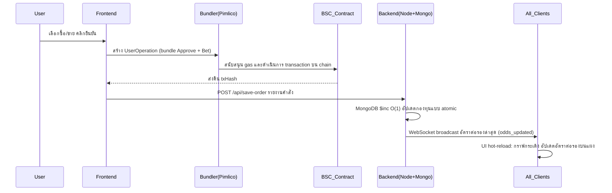
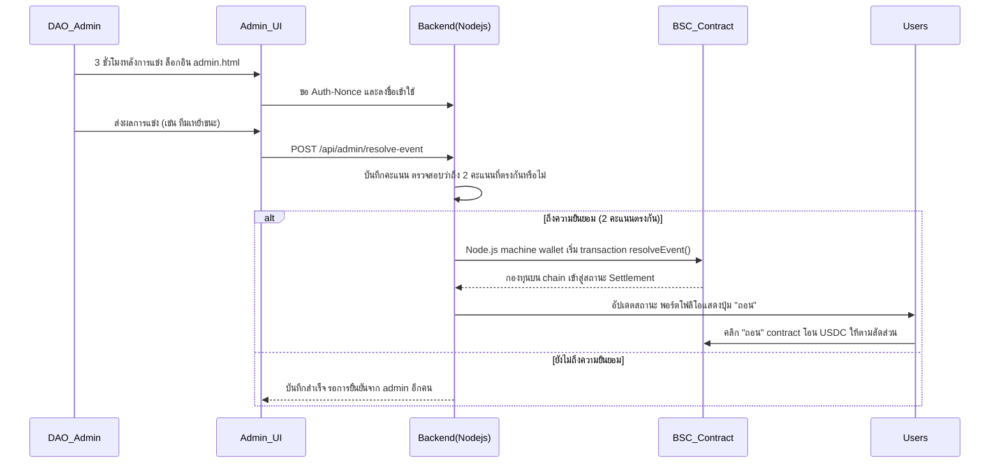

# ⚽ GlobalCup 2026 - Web3 ระบบเทรดตลาดพยากรณ์

> GlobalCup 2026 เป็น DApp ตลาดพยากรณ์แบบกระจายศูนย์ที่สร้างบน **BSC (Binance Smart Chain)** โครงการนี้ใช้ **Account Abstraction (ERC-4337) เทคโนโลยีไร้ Gas**, ผสมผสาน **การเทรดหุ้น AMM (Shares AMM)** กับ **กลไกตัดสินใจ Multi-signature ของ DAO** เพื่อมอบประสบการณ์พยากรณ์และเทรดกีฬา Web3 ที่ราบรื่นและเป็นมืออาชีพ

---

## 🌟 คุณสมบัติ

### 1. การเทรดแบบไร้ Gas ด้วย ERC-4337 (Gasless Trading)
- ผสาน **AppKit**, **Viem** และ **Permissionless.js** พร้อม Pimlico Paymaster สนับสนุนค่า Gas
- สร้าง Safe smart account ให้ผู้ใช้โดยอัตโนมัติ ดำเนินการเทรดแบบ batch เช่น `Approve` + `Bet` ในคลิกเดียว ลดอุปสรรค Web3 อย่างมาก

### 2. การเทรดสองทิศทางแบบ AMM (Share-based AMM & Cash Out)
- ละทิ้งอัตราต่อรองคงที่แบบดั้งเดิม ใช้อัลกอริทึมกลไกราคาแบบไดนามิก
- รองรับ **ซื้อ (Buy)** และ **ขาย/ปิดสถานะ (Sell/Cash Out)** ผู้ใช้สามารถปิดสถานะก่อนกำหนดได้ตลอดเวลาตามอัตราต่อรองแบบเรียลไทม์เพื่อล็อกกำไรหรือตัดขาดทุน

### 3. การแสดงราคาอัตราต่อรองแบบเรียลไทม์ (Real-time Odds)
- ผสาน MongoDB `O(1)` atomic updates กับ WebSocket (`Socket.io`) ประเภท broadcast ระดับมิลลิวินาที
- การเดิมพันของผู้ใช้ใดๆ จะทำให้อัตราต่อรองและกราฟทั่วทั้งเครือข่าย refresh ทันที

### 4. พอร์ตโฟลิโอและรายการโปรด (Portfolio & Favorites)
- แผงควบคุม "พอร์ตโฟลิโอ" ที่ใช้งานง่าย แสดง **มูลค่าปัจจุบัน** และ **กำไร/ขาดทุนที่ยังไม่รับรู้ (Unrealized PnL)** ของหุ้นที่ถืออยู่แบบเรียลไทม์
- รองรับการเพิ่มการแข่งขันลงรายการโปรดด้วยคลิกเดียวและการเชื่อมต่อสถานะข้ามแผงควบคุม

### 5. กลไกตัดสินใจแบบ Multi-signature ของ DAO (DAO Multi-sig Resolution)
- คอนโซลตัดสินใจ `admin.html` แยกต่างหาก อิงจากการยืนยันลายเซ็น Nonce ของ Web3 wallet
- หลังจากการแข่งขันสิ้นสุด ต้องมีสมาชิก DAO สองคนลงคะแนนตรงกัน และ bot แบ็กเอนด์จะอัปโหลดผลลัพธ์ไปยัง chain โดยอัตโนมัติ ทริกเกอร์การชำระกองทุน ป้องกันพฤติกรรมไม่ซื่อสัตย์จุดเดียว

### 6. หลายภาษาอัจฉริยะ (i18n Auto-detection)
- ระบุตำแหน่งผู้ใช้อัตโนมัติผ่าน IP Geolocation และ Browser Headers
- รองรับ **English**, 中文 (zh), **ไทย (th)** โดยกำเนิด พร้อมสลับภาษาทั้ง UI และข้อมูลพื้นฐานได้อย่างราบรื่น

---

## 🎮 สาธิตการใช้งานสำหรับชุมชน: ขั้นตอน 5 ขั้นตอนสู่กำไร

> ยินดีต้อนรับสู่ GlobalCup 2026 — ตลาดพยากรณ์บอลโลกแบบกระจายศูนย์รายแรกของโลกที่ไม่มีค่า Gas อยู่บน Chain ทั้งหมด รองรับ OTC สกุลเงินปกติ! มาสัมผัสกระบวนการ "หารายได้ 5 ขั้นตอน" ที่ราบรื่นของเรา:

### 🌟 ขั้นตอนที่ 1: เข้าสู่ระบบภายใน 1 วินาที (ไม่มีอุปสรรค)
- **ความเจ็บปวดดั้งเดิม:** การเล่น Web3 ต้องซื้อ BNB เพื่อค่า Gas ผู้เล่นใหม่ท้อแท้กันตั้งแต่แรก
- **วิธีของเรา:** คลิก **[เชื่อมต่อ Web3Wallet]** ระบบจะจัดสรร **"Smart Account"** ให้คุณโดยอัตโนมัติ ไม่ต้องเตรียม BNB ใดๆ ทุกการเดิมพันและการถอนของคุณบนแพลตฟอร์ม ค่า Gas จะถูกชำระโดยคลังของแพลตฟอร์ม! คลิกแล้วเล่นได้ทันที

### 💳 ขั้นตอนที่ 2: เติมเงินในคลิกเดียว (รองรับ OTC สกุลเงินปกติ)
ช่องทางการเติมเงินแบบรวดเร็ว 3 รูปแบบ:
- **ผู้เชี่ยวชาญ Chain:** คลิก **[ฝากเงิน]** → เลือก BSC → โอน USDC จากกระเป๋า MetaMask ของคุณ
- **ผู้ใช้ TRON:** เลือกเครือข่าย TRON → เรียก TronLink จ่าย USDT → ระบบข้าม Chain เป็น USDC อัตโนมัติ
- **มือใหม่สกุลเงินปกติ (OTC พิเศษ):** คลิก **[💱 OTC แลกเปลี่ยนสกุลเงินปกติ]** มุมบนซ้าย → เลือกพ่อค้าที่แพลตฟอร์มรับรอง → จ่ายผ่าน Alipay/WeChat อัปโหลดสกรีนช็อต พ่อค้าปล่อยเงินทันที — USDC เข้าบัญชี Smart ของคุณทันที!

### 🛒 ขั้นตอนที่ 3: ซื้อ "อัตราชนะ" เหมือนช้อปบน Taobao (จัดกลุ่มตะกร้า)
**กลไกหลัก:** การแข่งขันไม่ใช่การพนันน่าเบื่ออีกต่อไป แต่กลายเป็น "ซื้อขายหุ้น" ตัวอย่าง: อัตราชนะของ【ทีมอาร์เจนตินา】ในปัจจุบันคือ 60% หมายความว่าซื้อ 1 หุ้น "อาร์เจนตินาชนะ" ในราคา 0.6 USDC หากอาร์เจนตินาชนะในที่สุด หุ้น 1 หน่วยจะแลกเป็น 1 USDC — **กำไรสุทธิ 0.4 U ต่อหุ้น!**

**เทคโนโลยีพิเศษประหยัดเงิน:** ต้องการ 5 การแข่งขันที่แตกต่าง? อย่าซื้อทีละรายการ! คลิก 【🛒 เพิ่มลงตะกร้า】ใส่การแข่งขัน 5 รายการลงตะกร้าทั้งหมด แล้วคลิก 【ส่งแบบกลุ่มในคลิกเดียว】 ขับเคลื่อนด้วยเทคโนโลยี ERC-4337 Account Abstraction ล่าสุด — หลายธุรกรรมรวมเป็นหนึ่งเดียว รวดเร็วมาก!

### 📈 ขั้นตอนที่ 4: "ปิดสถานะก่อนกำหนด" ระหว่างการแข่งขัน (ไม่มีการล็อก ทำกำไรได้ตลอดเวลา)
- **วิธีของเรา:** กลัวที่จะซื้อ? หรืออาร์เจนตินาได้ 2 ประตูในครึ่งแรก อัตราชนะพุ่งสูงถึง 90%? ไม่ต้องรอจนการแข่งขันจบ!
- ใน【แผงเทรดมืออาชีพ】หรือ【สินทรัพย์ของฉัน】ด้านขวา คลิก【ปิดสถานะก่อนกำหนด (Cash Out)】คุณสามารถขายหุ้นคืนกองทุนตามราคาตลาด AMM แบบเรียลไทม์ได้ตลอดเวลา ทำกำไรได้ทันที

### 🏆 ขั้นตอนที่ 5: มติ Multi-signature การชำระบน Chain ทั้งหมด (ยุติธรรมแน่นอน)
- หลังการแข่งขันจบ คณะกรรมการกระจายศูนย์ของ GlobalCup (**DAO**) จะบันทึกผลลัพธ์ผ่าน Multi-signature
- เมื่อบรรลุข้อตกลง Smart Contract จะชำระบน Chain ทั่วทั้งเครือข่ายโดยอัตโนมัติ ผู้ชนะคลิก【ถอน】USDC กลับกระเป๋าโดยไม่มีความเสี่ยงถูกแพลตฟอร์มหักค่าธรรมเนียม

---

## 🔌 ภาพรวม API

แบ็กเอนด์สร้างบน **Node.js (Express) + MongoDB**

### 1. Public API
| Endpoint | Method | คำอธิบาย |
| :--- | :--- | :--- |
| `/api/events` | `GET` | ดึงข้อมูลพื้นฐานการแข่งขันทั้งหมดที่เก็บในฐานข้อมูล |
| `/api/win-rates` | `GET` | ดึงยอดกองทุนและอัตราการชนะแบบไดนามิก (odds) ของการแข่งขันทั้งหมด |
| `/api/trades/:id` | `GET` | ดึงบันทึกการเทรดทั้งหมดสำหรับการแข่งขันที่ระบุ (eventId) |
| `/api/locale` | `GET` | ตรวจจับภาษาสำรอง - ส่งคืนภาษาแนะนำโดยแปลงส่วนหัว `Accept-Language` |

### 2. Trading & User API
| Endpoint | Method | คำอธิบาย |
| :--- | :--- | :--- |
| `/api/save-order` | `POST` | รับข้อมูลเดิมพัน/ปิดสถานะจาก frontend อัปเดตกองทุนแบบ atomic (`$inc`) ทริกเกอร์ WS broadcast |
| `/api/user-portfolio` | `GET` | ส่ง `address` เพื่อดึงประวัติการเดิมพัน มูลค่าตำแหน่ง และ PnL ทั้งหมดของ smart account นั้น |
| `/api/user-payouts` | `GET` | ส่ง `address` เพื่อดึงรายการคำสั่งที่ชนะและสามารถถอนได้ |
| `/api/pimlico/56` | `POST` | ส่งต่อคำขอ Bundler/Paymaster เพื่อซ่อน API Key |

### 3. DAO Admin API
> **หมายเหตุ:** endpoints ทั้งหมดด้านล่างต้องผ่าน middleware `verifyDaoAuth` ตรวจสอบ `x-wallet-address`, `x-signature`, `x-nonce`, `x-timestamp` ในส่วนหัว

| Endpoint | Method | คำอธิบาย |
| :--- | :--- | :--- |
| `/api/admin/auth-nonce` | `GET` | endpoint pre-login สร้างข้อความลายเซ็นครั้งเดียวป้องกัน replay (Nonce) |
| `/api/admin/resolve-event`| `POST` | ส่งคะแนนการตัดสิน เมื่อสองคะแนนตรงกัน แบ็กเอนด์จะเรียก smart contract `resolveEvent` ชำระบน chain โดยอัตโนมัติ |
| `/api/admin/dao-members` | `GET` | ดึงรายชื่อสมาชิก DAO ทั้งหมดใน whitelist ปัจจุบัน |
| `/api/admin/dao-members` | `POST` | เพิ่มที่อยู่ BSC wallet ของสมาชิก DAO ใหม่ |
| `/api/admin/dao-members/:address`| `DELETE`| ลบสิทธิ์สมาชิก DAO ที่ระบุ (super admin และตัวเองไม่สามารถลบได้) |

---

## 🔄 แผนภาพ Workflow

### 1. การเทรดหลักและ Flow อัปเดตอัตราต่อรองแบบเรียลไทม์ (User Trading Flow)

### 2. DAO Multi-signature Resolution & Auto Settlement Flow (DAO Resolution Flow)

---

## 📖 คู่มือการใช้งาน

### 👤 คู่มือผู้ใช้ทั่วไป
1. **เชื่อมต่อ Wallet & ยืนยันตัวตน**: เปิดหน้าหลัก คลิก **[เชื่อมต่อ Web3Wallet]** มุมขวาบน หลังยืนยัน ระบบจะสร้าง smart account สำหรับเทรดแบบไร้ gas บน BSC ให้โดยอัตโนมัติ
2. **โอนเงิน (ฝาก)**: ก่อนเดิมพันครั้งแรก คลิก **[ฝากเงิน]** ที่แผง wallet มุมขวาบน ใส่จำนวนและยืนยันเพื่อโอนเงินจาก EOA wallet ส่วนตัวไปยัง smart account ของแพลตฟอร์ม
3. **การเทรดสองทิศทาง**:
   - **ซื้อ (Buy)**: เลือกทีมที่ชอบในแผงด้านขวา ใส่จำนวน USDC คลิกซื้อเพื่อรับ "หุ้น" จำนวน相应
   - **ปิดสถานะก่อนกำหนด (Cash Out)**: หากอัตราต่อรองเป็นใจ คลิก **[พอร์ตโฟลิโอ]** มุมขวาบน คลิก `[Cash Out]` ใน "ประวัติการเดิมพัน" ระบบจะซื้อคืนหุ้นของคุณในราคาตลาดแบบเรียลไทม์และส่งคืน USDC ทันที
4. **ถอนหลังการแข่ง**: หลังการแข่งสิ้นสุดและ DAO ตัดสิน หากคุณถือหุ้นฝ่ายชนะ ไปที่ **[พอร์ตโฟลิโอ]** และคลิก **[ถอน]** เงินต้นและกำไรจะโอนไปยัง smart account ของคุณโดยอัตโนมัติพร้อมเอฟเฟกต์เฉลิมฉลอง

### 🛡️ คู่มือ DAO Admin
1. **เข้าสู่ระบบ Admin**:
   - เยี่ยมชม `http://[โดเมนหรือIPของคุณ]:3010/admin.html`
   - คลิก **[เชื่อมต่อ Wallet & ยืนยันตัวตน]** และลงนามข้อความครั้งเดียว (Nonce) จากระบบใน MetaMask (ไม่มีค่า gas)
2. **การตัดสินใจ Multi-signature**:
   - หลังเข้าสู่ระบบ ในแผง **[การแข่งขันที่รอการตัดสิน]** คุณจะเห็นการแข่งขันทั้งหมดที่ **เวลาแข่งผ่านไป 3 ชั่วโมง** และยังไม่ได้ชำระ
   - ตามผลการแข่งขันจริง คลิก "ทีมเหย้าชนะ", "ทีมเยือนชนะ", หรือ "เสมอ"
   - เมื่อสมาชิก DAO สองคนลงคะแนนผลเดียวกันสำหรับการแข่งขันเดียวกัน ระบบจะทริกเกอร์ smart contract เพื่อชำระกองทุนการแข่งขันบน chain โดยอัตโนมัติ
3. **การจัดการสมาชิก DAO**:
   - สลับไปที่แท็บ **[การจัดการสมาชิก DAO]**
   - คุณสามารถใส่ที่อยู่ BSC wallet ของพันธมิตรที่เชื่อถือได้คนอื่นเพื่อเพิ่มเป็น DAO admin ที่มีสิทธิ์ลงคะแนน หรือลบได้ตลอดเวลา (super admin ไม่สามารถลบได้)

---

## 📋 Changelog

See [CHANGELOG.md](./CHANGELOG.md) for the full version history.
