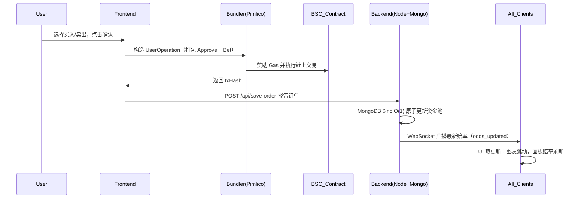
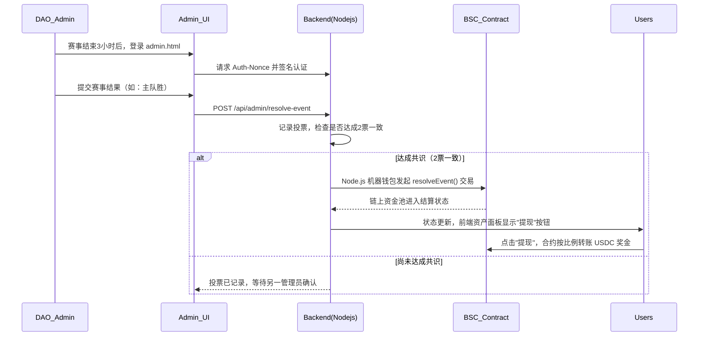

# ⚽ GlobalCup 2026 - Web3 预测市场交易终端

> GlobalCup 2026 是建立在 **BSC（币安智能链）** 上的去中心化预测市场 DApp。项目采用 **账户抽象（ERC-4337）零 Gas 费技术**，融合 **AMM 份额交易（Shares AMM）** 与 **DAO 多签裁决机制**，为用户提供流畅、专业的 Web3 体育预测及交易体验。

---

## 🌟 核心功能

### 1. ERC-4337 零 Gas 费交易
- 集成 **AppKit**、**Viem** 和 **Permissionless.js**，由 Pimlico Paymaster 赞助 Gas 费用。
- 自动为用户创建 Safe 智能账户，一键执行 `Approve` + `Bet` 批量交易，大幅降低 Web3 门槛。

### 2. AMM 份额双向交易（买入 & 提前平仓）
- 摒弃传统固定赔率，采用动态流动性池定价算法。
- 支持**买入（Buy）**和**卖出/平仓（Sell/Cash Out）**，用户可随时根据实时赔率提前平仓，锁定利润或截断亏损。

### 3. 实时赔率推送
- 结合 MongoDB `O(1)` 原子更新与 WebSocket（`Socket.io`）毫秒级广播。
- 任意用户下注，即时触发全网赔率与图表动态热更新。

### 4. 综合资产面板 & 收藏功能
- 直观的"资产"面板，实时显示持仓**当前价值**与**未实现盈亏（Unrealized PnL）**。
- 支持一键收藏赛事，跨面板状态联动。

### 5. DAO 多签安全裁决
- 独立的 `admin.html` 裁决控制台，基于 Web3 钱包 Nonce 签名认证。
- 赛事结束后，需两名 DAO 成员投票一致，后端机器人自动将结果上链，触发资金池结算，杜绝单点恶意行为。

### 6. 智能多语言（i18n 自动识别）
- 通过 IP 地理位置与浏览器请求头自动识别用户语言。
- 原生支持 **English**、**中文（zh）**、**ไทย（th）**，UI 与底层数据无缝热切换。

---

## 🎮 社区玩法演示：五步爆赚流程

> 欢迎来到 GlobalCup 2026 —— 全球首个零 Gas 费、全链上撮合、支持法币直入的去中心化世界杯预测市场！以下带你体验丝滑的"五步爆赚"流程：

### 🌟 第一步：1 秒丝滑登入（零门槛）
- **传统痛点：** 玩 Web3 需要先买 BNB 交手续费，新手直接劝退。
- **我们的玩法：** 点击【连接 Web3Wallet】，系统自动为你分配一个**"智能交易账户（Smart Account）"**。无需准备任何 BNB，你在平台上的每一次下注、每一次提现，平台（金库）都会替你代付 Gas 费！真正做到点击即玩。

### 💳 第二步：一键充值弹药（支持法币 OTC）
三种极速入金通道：
- **链上老手：** 直接点击【充值】→ 选择 BSC，从 MetaMask 钱包划转 USDC。
- **波场大户：** 选择 TRON 网络，调起 TronLink 支付 USDT，系统自动跨链映射为 USDC。
- **法币新手（独家 OTC）：** 点击左上角【💱 OTC 法币兑换】，选择平台认证的财务承兑商，支持支付宝/微信直接转账。上传截图后，商家秒放行，USDC 直接落入你的智能账户！

### 🛒 第三步：像逛淘宝一样买"胜率"（购物车批量打包）
**核心玩法：** 比赛不再是枯燥的"赌博"，而是变成了"买卖股票"。比如当前【阿根廷队】的胜率是 60%，意味着买入 1 份"阿根廷赢"需要 0.6 USDC。如果最终阿根廷夺冠，这 1 份将兑换为 1 USDC，**净赚 0.4 U！**

**独家省钱黑科技：** 看中了 5 场不同的比赛？别一场一场买！点击【🛒 加入购物车】，把 5 场比赛全部装进购物车，最后点击【一键批量发送】。底层采用最新的账户抽象（ERC-4337）聚合技术，多笔交易一次上链，速度极快！

### 📈 第四步：比赛中途"提前平仓"（拒绝锁仓，随时止盈）
- **我们的玩法：** 买入后后悔了？或者阿根廷上半场进了 2 个球，胜率飙升到 90%？不需要死等到比赛结束！
- 在右侧的【专业交易面板】或【我的资产】中，点击【提前平仓（Cash Out）】，你可以根据实时 AMM 动态市价，随时将手中的份额卖回给资金池，落袋为安。

### 🏆 第五步：多签决议，全链结算（绝对公平）
- 比赛结束后，由 GlobalCup 社区的去中心化委员会（**DAO**）通过多重签名进行结果录入。
- 结果一旦达成共识，智能合约将全网自动结算。中奖用户点击【提现】，USDC 秒回钱包，无任何平台扣留风险。

---

## 🔌 API 概览

后端基于 **Node.js (Express) + MongoDB** 构建。

### 1. 公开 API
| 端点 | 方法 | 说明 |
| :--- | :--- | :--- |
| `/api/events` | `GET` | 获取数据库中所有赛事基本信息。 |
| `/api/win-rates` | `GET` | 获取所有赛事的当前资金池总额及动态胜率（赔率）。 |
| `/api/trades/:id` | `GET` | 获取指定赛事（eventId）的所有历史交易记录。 |
| `/api/locale` | `GET` | 语言回退检测 — 通过解析 `Accept-Language` 头返回推荐语言。 |

### 2. 交易 & 用户 API
| 端点 | 方法 | 说明 |
| :--- | :--- | :--- |
| `/api/save-order` | `POST` | 接收前端下注/平仓数据，原子更新（`$inc`）资金池，触发 WS 广播。 |
| `/api/user-portfolio` | `GET` | 传入 `address`，返回该智能账户的完整下注历史、持仓市值及总盈亏。 |
| `/api/user-payouts` | `GET` | 传入 `address`，返回可提取的中奖订单列表。 |
| `/api/pimlico/56` | `POST` | 代理转发 Bundler/Paymaster 请求，隐藏 API Key。 |

### 3. DAO 管理 API
> **注意：** 以下所有端点均需通过 `verifyDaoAuth` 中间件验证，请求头中需包含 `x-wallet-address`、`x-signature`、`x-nonce`、`x-timestamp`。

| 端点 | 方法 | 说明 |
| :--- | :--- | :--- |
| `/api/admin/auth-nonce` | `GET` | 预登录端点，生成防重放的一次性签名消息（Nonce）。 |
| `/api/admin/resolve-event`| `POST` | 提交裁决投票。两票一致时，后端自动调用智能合约 `resolveEvent` 完成链上结算。 |
| `/api/admin/dao-members` | `GET` | 获取当前白名单中的所有 DAO 成员。 |
| `/api/admin/dao-members` | `POST` | 新增 DAO 成员的 BSC 钱包地址。 |
| `/api/admin/dao-members/:address`| `DELETE`| 移除指定 DAO 成员权限（超级管理员和自己不能移除）。 |

---

## 🔄 工作流图

### 1. 核心交易与实时赔率更新流程（用户交易流程）

### 2. DAO 多签裁决与自动结算流程

---

## 📖 用户操作指南

### 👤 普通用户指南
1. **连接钱包 & 激活**：打开主页，点击右上角【连接 Web3Wallet】。授权后，系统将在 BSC 上自动为你创建一个专属零 Gas 费交易智能账户。
2. **充值（入金）**：首次下注前，点击右上角钱包面板【充值】，输入金额并确认，将资金从你的个人 EOA 钱包转入平台智能账户。
3. **双向交易**：
   - **买入（Buy）**：在右侧面板选择你支持的队伍，输入 USDC 数量，点击买入，获得对应数量"份额"。
   - **提前平仓（Cash Out）**：比赛中赔率有利时，点击右上角【资产】，在"下注历史"中点击【Cash Out】。系统将以当前实时市场价格回购你的份额，USDC 即时返回。
4. **赛后提现**：比赛结束且 DAO 裁决完成后，如你持有获胜方份额，前往【资产】点击【提现】，本金与奖金自动转入你的智能账户，配合庆祝彩带特效。

### 🛡️ DAO 管理员指南
1. **管理员登录**：
   - 访问 `http://[你的域名或IP]:3010/admin.html`。
   - 点击【连接钱包 & 验证身份】，在 MetaMask 中签署系统下发的一次性消息（Nonce），无需 Gas 费。
2. **多签裁决**：
   - 登录后，在【待裁决赛事】面板中，你将看到所有**开赛时间超过3小时**且尚未结算的赛事。
   - 根据实际赛果，点击"主队胜"、"客队胜"或"平局"。
   - 当两位 DAO 成员对同一赛事投出相同结果时，系统自动触发智能合约完成该赛事资金池的链上结算。
3. **DAO 成员管理**：
   - 切换到【DAO 成员管理】标签页。
   - 可输入其他可信伙伴的 BSC 钱包地址，将其添加为有投票权的 DAO 管理员，也可随时移除（超级管理员无法移除）。

---

## 📋 更新日志

完整版本历史请参阅 [CHANGELOG.md](./CHANGELOG.md)。
